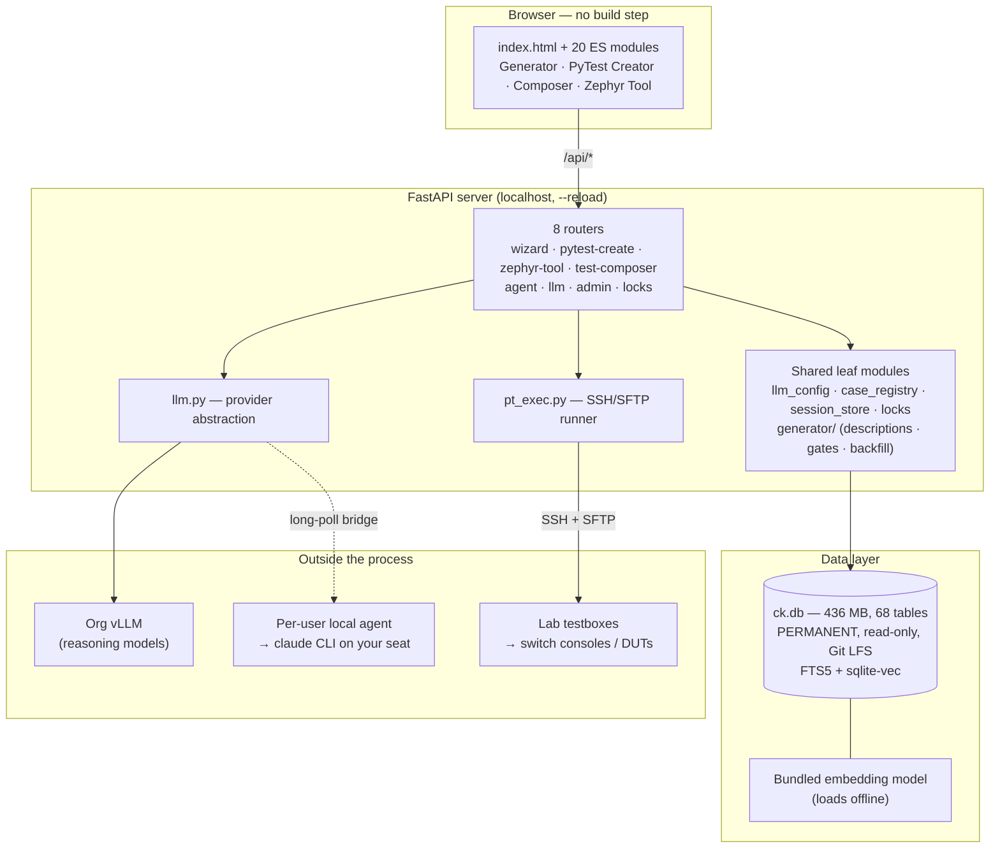

# Ask CK — Architecture, Executive Summary

**Audience:** anyone who needs the shape of the system without reading the code. For the deep
technical reference see [`CK-main/SERVER-README.md`](CK-main/SERVER-README.md); for current
status and backlog see [`objective-drafting/PROGRESS.md`](objective-drafting/PROGRESS.md).

**Figures below were measured on 2026-07-30**, not copied from prose. Re-measure before
quoting them elsewhere.

---

## 1. What it is

Ask CK is a **test-engineering workbench** that turns sparse, human-written manual test cases
(AWPTCM cases in Zephyr) into two things: **refined, traceable test specifications**, and
**runnable automated test scripts that execute on real switch hardware**.

It is a single-user, locally-run web application — ~11,000 lines of Python behind a
~5,300-line browser front end — sitting on top of a **436 MB read-only corpus database** and
a **live LLM**. What makes it unusual is not the web app: it is that the pipeline ends at a
serial console on a switch in a lab, and that a large amount of the engineering is spent
stopping a language model from producing test scripts that *look* correct.

---

## 2. Stack — what it is written in

**Short answer: Python on the back end, plain browser JavaScript on the front. No React, no
TypeScript, no Java, and no build step anywhere.**

| Layer | Language | Key libraries | Size |
|---|---|---|---|
| **Back end** | **Python** ≥ 3.10 (prefer **3.13**) | FastAPI, Uvicorn, Pydantic, Jinja2, `requests` | ~11,060 lines |
| **Front end** | **Vanilla JavaScript** (ES modules, `type="module"`) | **none** | 20 modules, ~5,279 lines with HTML |
| **Markup / styling** | HTML + CSS | none — one hand-written `styles.css` | 762 + 1,350 lines |
| **Data layer** | **SQL** (SQLite) | FTS5 (built in) + `sqlite-vec` extension | 68 tables/views |
| **Semantic search** | Python | `sentence-transformers`, `torch` (CPU wheel) | bundled model, offline |
| **Templating** | **Jinja2** | — | LLM prompts + the generated-script skeleton |
| **Generated output** | **Python 3** | Allied Telesis `framework` (ATTestSet/ATTestCase) | the product of the tool |
| **Automation / entry points** | **Bash** | — | `setup.sh`, `run.sh`, `tool/*.sh` |

**The front end has no framework and no bundler by design.** `index.html` loads 20 ES modules
directly; the browser resolves them natively. There is no JSX, TypeScript, Vue or Svelte
anywhere in the tree, and no Vite/Webpack/Rollup/Babel config. The only JavaScript
dependencies in `package.json` are **dev-only test tooling** — Vitest, jsdom,
`@testing-library/dom`, Playwright — so nothing is compiled to ship, and editing a `.js` file
is live on the next reload.

Why it matters at this scale: a single-user internal tool that hot-reloads with `--reload` and
serves static modules has no compile step to get wrong, no lockfile drift in the shipped
artifact, and no framework upgrade treadmill. The trade is that state management is manual
(`state.js`, `session.js`) rather than handed to a framework — acceptable for ~5k lines, and it
would not be at ten times that.

**Python version is a correctness constraint, not a preference.** The PyTest Creator lints
*generated* scripts with `py_compile` under the server's interpreter, while those scripts
execute under the **testbox's** `python3` (tb470 runs 3.13.5). A mismatch lints the wrong
language version — that is how a `distutils` import, removed in 3.12, once shipped to a 3.13
testbox and would have failed every generated script at import.

---

## 3. Shape

Three boundaries matter, and they are the three places things break:

| Boundary | Nature | Failure mode it introduces |
|---|---|---|
| Browser ↔ server | Local HTTP, per-tab session id | Concurrent edits to one case (mitigated by per-case locking) |
| Server ↔ LLM | Network, non-deterministic output | Plausible-but-wrong content; the main engineering cost |
| Server ↔ testbox | SSH into shared lab hardware | Bench state ≠ declared state; destructive if unguarded |

---

## 4. The four tools

| Tool | State | What it does |
|---|---|---|
| **Objective / Test Case Generator** | **Complete** | 6-step gated flow: pick case → review historical TestLink cases → Zephyr cross-refs → ATPyLib automated coverage → synthesise objectives + steps → export bundle and push to Zephyr Scale (v2.0, idempotent). ~42 cases refined. |
| **PyTest Creator** | **Complete** | 7-step gated flow: refined case → extract an automatable sequence → search 830 reused scripts → select code fragments → **fill a fixed skeleton** → run on a testbox over SSH → LLM fix loop to final validation. |
| **Test Composer** | Scaffolded | Not implemented. |
| **Zephyr Templating Tool** | Scaffolded | Not implemented. |

**Every step is a review gate.** Nothing advances on model output alone — a human confirms, and
the confirm button enforces machine-checkable rules (e.g. every Zephyr step must map to at
least one automated step, or the confirm returns 409 quoting the untested step). This is the
core product decision: the LLM drafts, the engineer ratifies, and the system refuses to let an
unratified step through.

---

## 5. Data layer — one permanent database

`ask-ck/var/ck.db` is the **single runtime source of truth**: built once from supplied data,
shipped via Git LFS, and **never rebuilt**. There is no corpus API, no JSON fallback, no
refresh path. A fresh clone gets a working, fully-populated database with zero build step.

| Corpus | Rows | Role |
|---|---|---|
| `zephyr_cases` | 45,427 | The managed case universe |
| `testlink_cases` | 21,620 | Historical human-authored cases (context + overlap) |
| `atp_tests` | 10,157 | Enriched automated suites — what automation actually tests *for* |
| `scripts` / `script_chunks` | 830 / 5,782 | The reusable script corpus, **including full source text** |
| `cli_commands` / `cli_command_products` | 6,323 / 68,301 | Authoritative AlliedWare Plus CLI reference; 1,250 commands carry real sample output |
| `candidates` / `decisions` | 410 / 410 | Case triage state |
| `embeddings_meta` | 83,816 | Vectors for semantic search |
| `sessions` | 39 | Live workbench state (the one table users write) |

**Search is hybrid**: SQLite **FTS5** keyword search fused with **sqlite-vec** nearest-neighbour
search over bundled embeddings, merged by reciprocal-rank fusion. The embedding model ships with
the repo and loads offline, so search has no external dependency.

---

## 6. LLM strategy — pluggable by design, because output must be comparable

`llm.py` abstracts the provider behind one interface, with **seven auth modes** (`local_llm`,
`claude_agent`, `claude_code`, `api_key`, `token`, `grok_cli`, `mock`). Three are load-bearing:

- **Local LLM (default)** — the org vLLM, OpenAI-compatible, Fast/Thinking toggle. These are
  *reasoning* models: they emit chain-of-thought before content, and the transport **streams**
  so the read timeout bounds the gap between chunks rather than the whole response.
- **Per-user Claude agent** — a tiny local agent on the engineer's own machine, reached by a
  long-poll bridge, shelling out to the `claude` CLI on their seat. Keeps per-seat entitlement
  out of the server.
- **Mock** — deterministic, for tests.

Two features exist because model output cannot be taken on trust:

- **Provenance** — every LLM panel can display and copy the *exact* prompt it would send, and
  refresh it live via a zero-token dry run. The prompt is portable: paste it into a competing
  model and compare.
- **Observability** — per-request token counts and a per-session log, so cost and behaviour are
  visible rather than inferred.

The org vLLM is the **one live external dependency**, and it is core function, not an
integration to be removed.

---

## 7. The hardware bridge

`pt_exec.py` uploads a generated script over SFTP into a per-run workdir on a lab testbox,
symlinks the read-only framework, and runs it under `sudo` with the bench's `.setup` topology
file. Results are parsed back into per-TestCase PASS/FAIL.

The interesting engineering here is defensive, because **a lab bench is shared, mutable, and
lies about itself**:

- The framework tree is **read-only and guarded** — redirection, interpreters, `rsync`,
  `install` and `cp -t` into it are all blocked, not just `rm`.
- SSH host keys are pinned trust-on-first-use; the run command is `shlex`-quoted and
  metacharacter-validated.
- A generated script **names no device and no port**. It resolves its topology from the bench's
  own declaration at run time, so the same file runs on a chassis, a stack, or a standalone
  switch unchanged.
- Before a run, `tool/pt_preflight.py` answers *offline* whether a bench can host a script at
  all; `tool/pt_profiles.py` answers whether a bench implements the topology contract; and at
  run time `tool/pt_media.py` asserts the bound port's physical media.

That last set exists because of a specific, expensive failure class: the framework returns
`(None, None)` for a link the bench never declared, and the CLI accepts nonsensical settings
(`speed 100` on a fibre port) without complaint. Both produce runs that **fail looking like
product defects when the real cause is cabling**. Feeding a false defect report into a judging
pipeline is worse than failing loudly, so the system now refuses to start such a run.

---

## 8. Four invariants

These are architectural commitments, each backed by an automated check rather than a
convention:

1. **`ck.db` is the permanent single source of truth** — built once, Git LFS, not gitignored,
   not rebuildable.
2. **The server reads corpora only from `ck.db`** — zero runtime JSON. Enforced by
   `tool/guard_db_only.py`.
3. **The testbox framework tree is read-only.** Enforced by
   `tool/guard_framework_readonly.py`.
4. **The org vLLM is the only live external dependency**, and it is core function.

---

## 9. Quality mechanism

One command, `./tool/run_tests.sh`, runs both invariant guards plus **719 backend tests and 92
front-end tests**; a Playwright end-to-end test is run sparingly outside that gate. Test traffic
runs against a throwaway copy of the database, because polluting the permanent one with
synthetic sessions produces worthless data.

Three habits in the suite are worth naming, because they are what keeps a
non-deterministic pipeline honest:

- **Structural tests**, not just example tests — e.g. an AST sweep proving no async handler
  calls a blocking function unwrapped. These catch the *next* regression, not only the one filed.
- **Prompts are executed against real data.** Where prose and a worked example disagree, a model
  copies the example — so the prompts' own examples are run against real harvested CLI output.
  Several generated-script defects were traced to wrong examples in our own files.
- **Claims are mutation-tested.** A check that cannot fail proves nothing, so checks are
  deliberately broken to confirm they bite before their findings are trusted.

---

## 10. Deployment posture, and the honest limits

Designed for **localhost, single-user**: binds `127.0.0.1` (LAN exposure is an explicit opt-in),
runs with `--reload` so code edits are picked up without a restart, and has a hidden admin panel
for session resets. The front end is plain ES modules with **no build step**.

Known limits, stated plainly:

- **No authentication.** Multi-user identity is planned and blocked on an organisational
  identity decision. Per-case locking has shipped, which closes the concurrent-overwrite bug
  that was live with two browser tabs.
- **Two of four tools are scaffolds.**
- **The generation quality problem is not finished.** Fabricated CLI output was eliminated by
  grounding the prompts in the real command reference, and topology over-declaration was fixed
  structurally. The open defect is **sequence-step misclassification**: per-case reconfigurations
  collapsing into one-time setup, and physical cable-swap steps being satisfied with CLI commands
  that only simulate them. That is the current cause of a bad grade on one of the three
  reference cases, and it is a classification problem rather than a model-quality problem.
- **Hardware validation is incomplete.** The execution-judging phase has not yet run on real
  hardware end to end.

---

## 11. Where the real risk sits

Not in the web application, which is small and conventional. It sits in two places:

**The LLM is inside the product, not beside it.** Every mitigation — review gates, coverage
enforcement, CLI grounding, prompt provenance, executable prompt examples, offline pre-flight
checks — exists to make non-deterministic output *auditable*. The dominant failure mode is not
a crash; it is a confident, plausible, wrong test that passes review because it looks right.

**The lab bench is authoritative and it drifts.** Declared topology, console-to-unit mappings
and pluggable media all rot as hardware is recabled, and the switch CLI does not reject
physically meaningless commands. The system's defence is to verify against the hardware and
refuse to run rather than infer — and to make every such refusal say *"bench problem, not a
product defect"*, so a cabling error is never recorded as a product failure.
